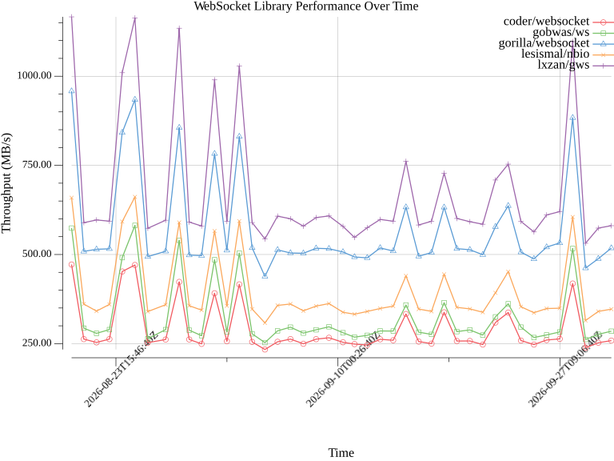

# go-websocket-libraries

Go WebSocket Library Comparison

**Libraries Benchmarked:**

- https://github.com/gorilla/websocket
- https://github.com/lxzan/gws
- https://github.com/gobwas/ws
- https://github.com/lesismal/nbio
- https://github.com/coder/websocket

**Latest Benchmark Results:**

<!-- BENCHMARK_TABLE_START -->
**Last Updated:** Wed, 07 Oct 2026 09:13:35 UTC

| Library                                         | Version         | Throughput (MB/s) | Avg Latency (ms) |
| ----------------------------------------------- | --------------- | ----------------- | ---------------- |
| [coder/websocket](https://github.com/coder/websocket) | v1.8.15 | 306.52 | 25.29 |
| [gobwas/ws](https://github.com/gobwas/ws) | v1.4.0 | 332.70 | 23.28 |
| [gorilla/websocket](https://github.com/gorilla/websocket) | v1.5.3 | 630.76 | 12.31 |
| [lesismal/nbio](https://github.com/lesismal/nbio) | v1.7.1 | 419.67 | 18.51 |
| [lxzan/gws](https://github.com/lxzan/gws) | v1.10.2 | 742.40 | 10.48 |
<!-- BENCHMARK_TABLE_END -->

**Performance Over Time: Throughput (MB/s):**

