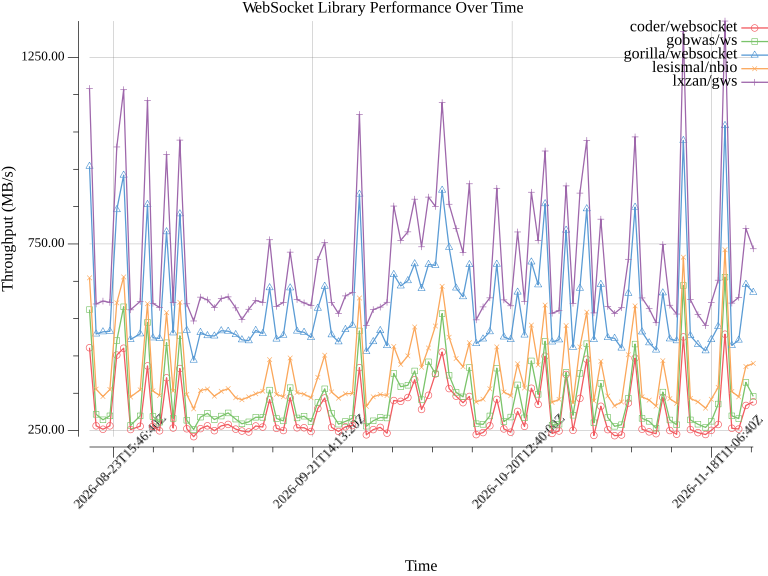

# go-websocket-libraries

Go WebSocket Library Comparison

**Libraries Benchmarked:**

- https://github.com/gorilla/websocket
- https://github.com/lxzan/gws
- https://github.com/gobwas/ws
- https://github.com/lesismal/nbio
- https://github.com/coder/websocket

**Latest Benchmark Results:**

<!-- BENCHMARK_TABLE_START -->
**Last Updated:** Sun, 22 Nov 2026 10:15:28 UTC

| Library                                         | Version         | Throughput (MB/s) | Avg Latency (ms) |
| ----------------------------------------------- | --------------- | ----------------- | ---------------- |
| [coder/websocket](https://github.com/coder/websocket) | v1.8.15 | 254.01 | 30.45 |
| [gobwas/ws](https://github.com/gobwas/ws) | v1.5.0 | 282.10 | 27.37 |
| [gorilla/websocket](https://github.com/gorilla/websocket) | v1.5.3 | 492.36 | 15.70 |
| [lesismal/nbio](https://github.com/lesismal/nbio) | v1.7.2 | 340.36 | 22.75 |
| [lxzan/gws](https://github.com/lxzan/gws) | v1.10.2 | 607.02 | 12.76 |
<!-- BENCHMARK_TABLE_END -->

**Performance Over Time: Throughput (MB/s):**

