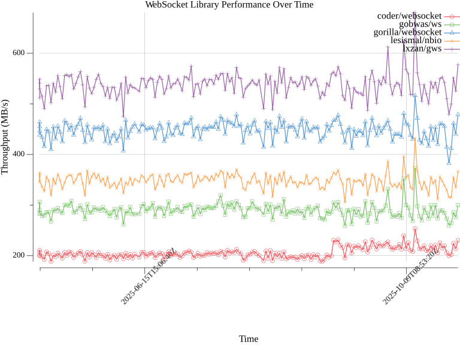

# go-websocket-libraries

Go WebSocket Library Comparison

**Libraries Benchmarked:**

- https://github.com/gorilla/websocket
- https://github.com/lxzan/gws
- https://github.com/gobwas/ws
- https://github.com/lesismal/nbio
- https://github.com/coder/websocket

**Latest Benchmark Results:**

<!-- BENCHMARK_TABLE_START -->
**Last Updated:** Mon, 08 Dec 2025 03:46:09 UTC

| Library                                         | Version         | Throughput (MB/s) | Avg Latency (ms) |
| ----------------------------------------------- | --------------- | ----------------- | ---------------- |
| [coder/websocket](https://github.com/coder/websocket) | v1.8.14 | 200.75 | 38.56 |
| [gobwas/ws](https://github.com/gobwas/ws) | v1.4.0 | 263.14 | 29.43 |
| [gorilla/websocket](https://github.com/gorilla/websocket) | v1.5.3 | 412.17 | 18.74 |
| [lesismal/nbio](https://github.com/lesismal/nbio) | v1.6.7 | 309.78 | 24.97 |
| [lxzan/gws](https://github.com/lxzan/gws) | v1.8.9 | 488.66 | 15.89 |
<!-- BENCHMARK_TABLE_END -->

**Performance Over Time: Throughput (MB/s):**

